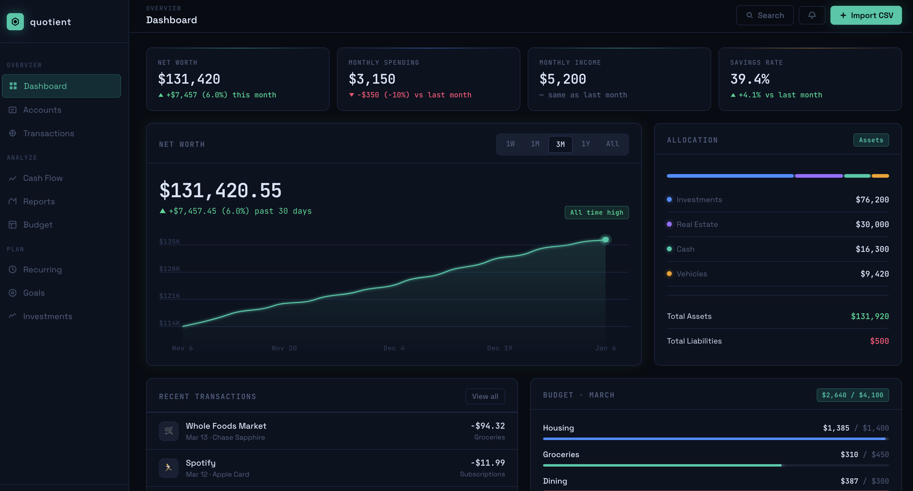

# Quotient

A local-first personal finance app built with Electron. All data stays on your machine — no accounts, no cloud sync, no subscriptions.


> *All values shown are fictional examples for illustration purposes.*

---

## Features

**Dashboard**
- Net worth over time with 1W / 1M / 3M / 1Y / All period selector
- Monthly spending, income, and savings rate with month-over-month comparison
- Asset allocation breakdown by account type
- Recent transactions and budget progress at a glance

**Accounts**
- Checking, savings, credit card, investment, 401(k), IRA, real estate, vehicle, personal property, and more
- Assets and liabilities tracked separately for net worth calculation
- Balance sync from transaction history

**Transactions**
- Import from CSV — auto-detects column mapping for most bank exports
- Smart auto-categorization using a built-in rule set (Starbucks → Coffee, Whole Foods → Groceries, etc.)
- Persistent categorization rules: teach the app once ("potbelly" → Restaurants) and it remembers on every future import
- Filters: search, account, date range, amount range, uncategorized-only, transfers toggle
- Bulk actions: set category, mark/unmark as transfer, delete across multiple transactions at once
- Notes on individual transactions

**Budget**
- Monthly budgets per category
- Visual progress bars with over/under indicators
- Arrow-key navigation between months

**Categories**
- Full CRUD for custom categories (name, emoji icon, color)
- View and delete saved import rules

**Recurring**
- Track bills and subscriptions with frequency and expected amount
- Auto-matches recent transactions to show last payment date and amount

**Goals**
- Savings goals with target amount, target date, and contribution tracking

**Investments**
- Manual holdings tracker (ticker, shares, cost basis, current price)

---

## Tech Stack

- **Electron** + **Vite** + **React** + **TypeScript**
- **SQLite** via `better-sqlite3` (main process only, never leaves your machine)
- **Recharts** for charts
- **PapaParse** for CSV parsing

---

## Development

```bash
npm install
npm run dev
```

## Build

```bash
npm run build
npm run dist
```

Data is stored in Electron's `userData` directory:
- macOS: `~/Library/Application Support/quotient/quotient.db`
- Windows: `%APPDATA%\quotient\quotient.db`
- Linux: `~/.config/quotient/quotient.db`
